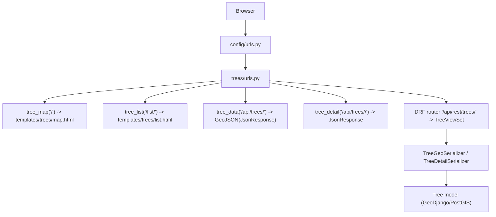

# DATreeMap 전체 리뷰 2단계: 코드베이스 맵

작성일: 2026-02-26  
기준 브랜치: `main`

## 1) 시스템 개요

- 런타임: Django 5.1 + DRF + GeoDjango(PostGIS)
- UI 방식: Django Template + 정적 JS(Leaflet)
- 핵심 도메인: `Tree`(지리 좌표/수목 정보), `User`(커스텀 유저)
- 배포: Docker Compose(개발/운영), 운영은 Gunicorn + Nginx 분리

## 2) 디렉터리 책임 맵

- `config/`: 전역 설정, URL 루트, ASGI/WSGI 엔트리
- `trees/`: 주요 비즈니스 도메인(모델, 뷰, API, CSV 임포트)
- `users/`: 커스텀 유저 모델/관리자 설정
- `common/`: 공통 추상 모델(`created_at`, `updated_at`)
- `templates/trees/`: 지도/목록/API 테스트 페이지 렌더링
- `static/js/map.js`: 지도 렌더링, 클러스터링, 필터, 상세 모달
- `Dockerfile*`, `docker-compose*`, `nginx/`: 개발/운영 런타임 구성

## 3) 엔트리포인트/라우팅 맵

현재 URL 집합:
- 템플릿 페이지: `/`, `/list/`, `/drf-test/`
- 비-DRF API: `/api/trees/`, `/api/trees/<tag_number>/`
- DRF API: `/api/rest/trees/`, `/api/rest/trees/<pk>/`
- 관리자: `/admin/`

## 4) 요청 흐름 맵 (핵심 시나리오)

### A. 지도 화면 진입

1. `GET /`  
2. `trees.views.tree_map`가 `templates/trees/map.html` 렌더  
3. 브라우저가 `static/js/map.js` 실행  
4. JS가 `GET /api/rest/trees/` 호출  
5. `TreeViewSet(list)` + `TreeGeoSerializer` 응답  
6. Leaflet 마커/클러스터 렌더링, 필터 UI 동작

### B. 지도 팝업 상세 보기

1. 지도 팝업 버튼 클릭  
2. JS가 `GET /api/rest/trees/<tag>/` 호출  
3. `TreeViewSet(retrieve)` + `TreeDetailSerializer` 응답  
4. 모달로 상세 표시

### C. 목록 화면 검색/정렬/페이징

1. `GET /list/?search=&common_name=&health=&sort=&order=&page=`  
2. `trees.views.tree_list`에서 ORM 필터/정렬 적용  
3. `Paginator(20)`로 페이지 생성  
4. `templates/trees/list.html`에 서버 렌더링

### D. CSV 임포트(배치)

1. `python manage.py import_trees <csv>`  
2. `trees/management/commands/import_trees.py`가 CSV 파싱  
3. `Tree` 생성 후 `save()` 시 `Point(longitude, latitude)` 생성  
4. DB(PostGIS)에 저장

## 5) 데이터 모델 맵

### `trees.Tree`

- 식별: `tag_number`(PK)
- 이름: `common_name`, `botanical_name`
- 좌표: `latitude`, `longitude`, `location(PointField)`
- 속성: `diameter`, `height`, `crown_height`, `crown_spread`, `health`
- 메타: `last_update`, `notes`, `alternate_tag`, `quantity`
- 관계: `contributors` (M2M to `users.User`)
- 공통 필드 상속: `created_at`, `updated_at` (`common.CommonModel`)

### `users.User` (AbstractUser 확장)

- 프로필: `profile_photo`, `name`, `gender`, `language`
- 권한 관련: `is_contributor`
- 관계: `my_trees` (M2M to `trees.Tree`)

## 6) 운영 런타임 맵

### 개발

- `docker-compose.yml` 또는 `docker-compose.dev.yml`
- `web` 서비스: `wait_for_db -> migrate -> runserver`
- `db` 서비스: PostGIS

### 운영

- `docker-compose.prod.yml`
- `web`: Gunicorn 실행
- `nginx`: 정적/미디어 서빙 + `/api`, `/admin` 프록시

## 7) 복잡도 기반 우선 리뷰 파일 (Step 4 입력)

파일 크기와 실행 빈도 기준 우선순위:

1. `static/js/map.js` (773 lines): 지도 핵심 상호작용/필터/상세 조회
2. `templates/trees/list.html` (459 lines): 목록 UX/쿼리 파라미터 보존
3. `config/settings.py` (178 lines): 보안/DB/정적 경로/앱 설정
4. `trees/views.py` (130 lines): 조회 API/검색/정렬/예외 처리
5. `trees/management/commands/import_trees.py` (77 lines): 데이터 유입 경로

## 8) 구조상 확인된 불일치/주의점 (후속 리뷰 대상)

- 문서/도커 일부가 `frontend/` 경로를 참조하지만 현재 저장소에는 `frontend.bak/`만 존재
- 비-DRF API(`/api/trees/*`)와 DRF API(`/api/rest/trees/*`)가 공존
- 자동화된 테스트 파일은 존재하나 현재 내용은 대부분 템플릿 수준(실질 테스트 부재)

위 3가지는 3~4단계에서 실제 동작/회귀 위험 관점으로 검증한다.
